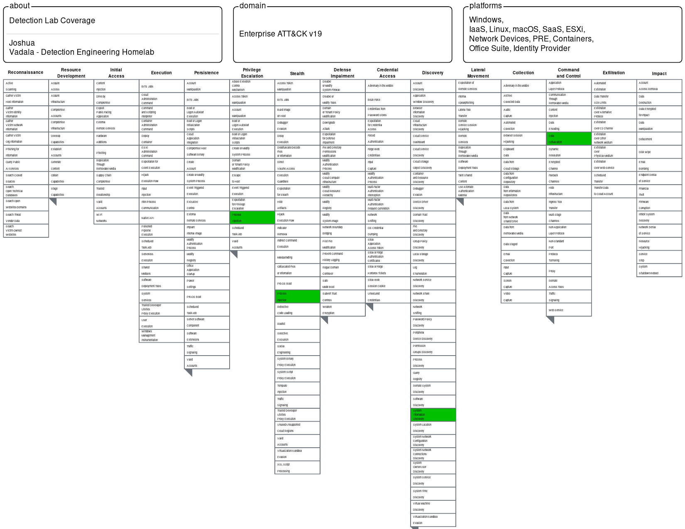

# Detection Lab

A self-hosted detection engineering homelab built to simulate real-world threat detection across network and endpoint telemetry. All detections are mapped to the MITRE ATT&CK framework.

## Stack

| Component | Tool | Purpose |
|-----------|------|---------|
| Sensor OS | WSL2 Ubuntu 22.04 on Windows 11 | Host environment |
| IDS | Suricata (Docker) | Network threat detection via EVE JSON |
| NSM | Zeek (Docker) | Network metadata (conn, dns, http, ssl logs) |
| Endpoint | Sysmon + Elastic Defend | Windows process and registry telemetry |
| Agent | Elastic Agent 8.13 | Log shipping via Fleet |
| SIEM | Self-hosted Elasticsearch + Kibana (Docker) | Detection rule engine and alerting |

## Architecture

```text
Suricata + Zeek (Docker, network_mode: host)
                ↓
     EVE JSON + conn/dns/http/ssl logs

Elastic Agent (Docker)
                ↓
    Fleet-managed log shipping

Elasticsearch + Kibana (Docker, self-hosted)
                ↓
      KQL detection rules + alerting

Windows 11 VM (VirtualBox)
                ↓
 Sysmon + Elastic Defend endpoint telemetry
```

## ATT&CK Coverage



## Detections

| # | Detection | ATT&CK ID | Tool | Write-up |
|---|-----------|-----------|------|----------|
| 001 | PurpleFox C2 Beacon — Hex `.moe` URI | T1071.001 | Suricata | [Link](detections/001-purplefox-c2/README.md) |
| 002 | Qakbot C2 Check-in — Numeric `.dat` URI | T1071.001 | Suricata | [Link](detections/002-qakbot-c2/README.md) |
| 003 | Emotet C2 POST — Multipart Form Data | T1071.001 | Suricata | [Link](detections/003-emotet-c2/README.md) |
| 004 | IcedID C2 — Suspicious TLD SSL/SNI | T1071.001, T1573.002 | Zeek + KQL | [Link](detections/004-icedid-c2/README.md) |
| 005 | Cobalt Strike HTTP Beacon — Short URI Burst | T1071.001, T1001 | Suricata | [Link](detections/005-cobalt-strike-beacon/README.md) |
| 006 | PowerShell CreateRemoteThread — Process Injection | T1055 | Sysmon + KQL | [Link](detections/006-powershell-process-injection/README.md) |
| 007 | System Information Discovery — `systeminfo.exe` | T1082 | Elastic Defend + KQL | [Link](detections/007-system-information-discovery/README.md) |
| 008 | Registry Run Key Persistence | T1547.001 | Elastic Defend + KQL | [Link](detections/008-registry-run-key-persistence/README.md) |

| 009 | PowerShell Execution — Mimikatz via encoded command | T1059.001 | Sysmon + KQL | [link](detections/009-powershell-execution/README.md) |
| 010 | Scheduled Task Persistence — OnLogon/OnStartup | T1053.005 | Sysmon + KQL | [link](detections/010-scheduled-task-persistence/README.md) |

## Detection Gaps

| Technique | ATT&CK ID | Gap Reason | Telemetry Status |
|------------|------------|------------|------------------|
| OS Credential Dumping: LSASS Memory | T1003.001 | Blocked by Windows Credential Guard; no process telemetry generated | ⚠️ No signal |

## Repository Structure

```text
detection-lab/
├── detections/                 # Individual detection write-ups
│   ├── 001-purplefox-c2/
│   ├── 002-qakbot-c2/
│   ├── ...
│   └── rules_export.ndjson     # Exported KQL detection rules
├── suricata/                   # Suricata configuration and custom rules
├── zeek/                       # Zeek logs and configuration
├── kibana/                     # Kibana configuration
├── scripts/                    # Startup and maintenance scripts
├── attack-navigator-layer.json
└── Detection_Lab_Coverage.png
```

## Goals

- Build and validate custom detections across network and endpoint telemetry.
- Map detections to MITRE ATT&CK techniques.
- Develop detection engineering workflows using Elastic SIEM.
- Document detection logic, telemetry requirements, and testing methodology.
- Identify and track visibility gaps in the lab environment.

## Future Work

- Add credential access detections (T1003, T1555).
- Expand PowerShell and LOLBin coverage.
- Create Sigma rule equivalents for all detections.
- Automate ATT&CK Navigator layer generation.
- Add Atomic Red Team validation procedures.

## SIGMA Rules

| Rule | Technique | ATT&CK ID | File |
|------|-----------|-----------|------|
| PowerShell CreateRemoteThread Process Injection | Process Injection | T1055 | [link](sigma/proc_injection_powershell_createremotethread.yml) |
